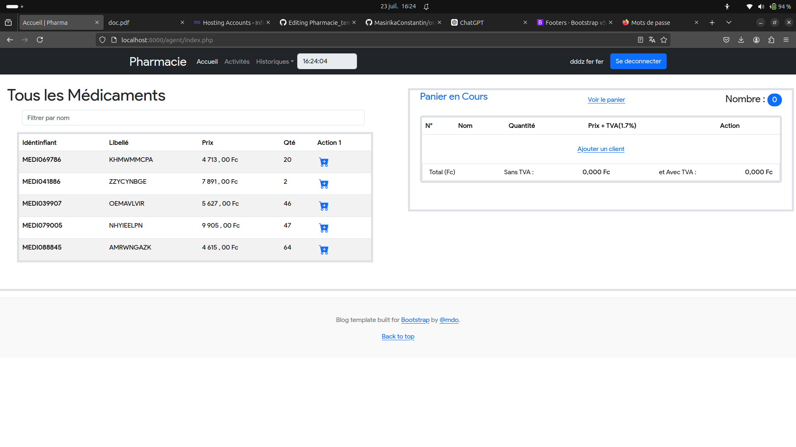
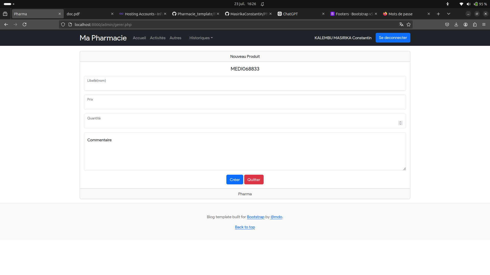

# Projet de Pharmacie


<p style="color: blue; font-size: 20px;">Ce projet est une application de gestion de pharmacie.</p>

<p style="color: green;">Fonctionnalités principales :</p>
<a href="http://mascode.kesug.com" style="font-size:30px;text-decoration: none;">Demo du site</a>
<ul>
    <li style="color: red;">Gestion des stocks</li>
    <li style="color: orange;">Traitement des ordonnances</li>
    <li style="color: purple;">Suivi des ventes</li>
    <li style="color: teal;">Rapports</li>
</ul>
## Description

Ce projet est une application de gestion de pharmacie qui permet de :

- Gérer les stocks de médicaments
- Traiter les ordonnances
- Suivre les ventes et les achats
- Générer des rapports

## Fonctionnalités

- **Gestion des stocks :** Ajout, mise à jour et suppression de médicaments.
- **Traitement des ordonnances :** Saisie et gestion des ordonnances des patients.
- **Suivi des ventes :** Enregistrement et suivi des transactions de vente.
- **Rapports :** Génération de rapports de vente et de stock.

## Installation

1. Clonez le dépôt :
    ```sh
    git clone https://github.com/MasirikaConstantin/Pharmacie_template.git
    ```
2. Naviguez dans le répertoire du projet :
    ```sh
    cd Pharmacie_template
    ```
3. Installez les dépendances :
    ```sh
    Suivez les instructions pour installer PHP 8.2
    ```
4. Lancez l'application :
    ```sh
    php -S localhost:8000
    ```

## Captures d'écran


*Page d'accueil de l'application.*


*Module de gestion des stocks.*

## Contribuer

Les contributions sont les bienvenues ! Veuillez suivre les étapes suivantes pour contribuer :

1. Fork le projet.
2. Créez une branche pour votre fonctionnalité (`git checkout -b feature/AmazingFeature`).
3. Commitez vos changements (`git commit -m 'Add some AmazingFeature'`).
4. Poussez vers la branche (`git push origin feature/AmazingFeature`).
5. Ouvrez une Pull Request.


